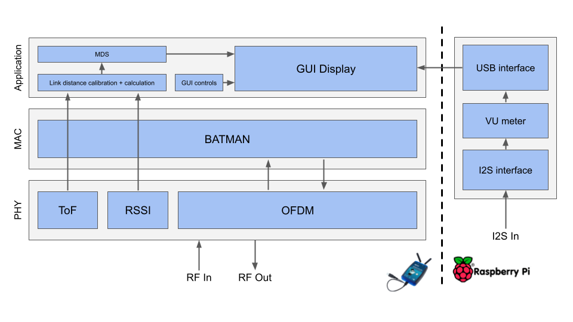
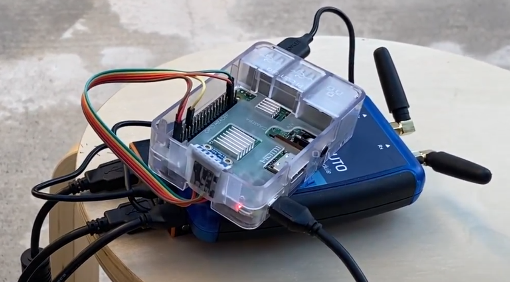

# WES capstone project: Wireless Sensor Network Localization on Plutos

## Project overview
Wireless sensor networks can be very useful for recording, localizing, and visualizing a measured quantity over a space. This project aims to tackle the second step (localization), specifically by eliminating the need for additional hardware. In order to localize the nodes in a network, each node measures the distance between it and its neighbors using Received Signal Strength (RSSI) and Time-of-Flight (ToF). These two measurements are combined using Bayesian fusion and filtered using a single-variable Kalman filter. From there, the overall network topology is reconstructed using Multi-Dimensional Scaling (MDS). 

## System overview
TODO: elaborate

## Getting started
This repo contains the build artifacts and source code necessary to demonstrate 5-node network capability. Each node consists of the following hardware:
* Adalm PLUTO
* Adafruit’s I2S MEMS Microphone Breakout - SPH0645LM4H
* Raspberry Pi 3B
* Lumsing PBJ-6200 6000 mAh Powerbank
* 3x USB-A to Micro-USB cables
* Wires

An example node is shown below:
